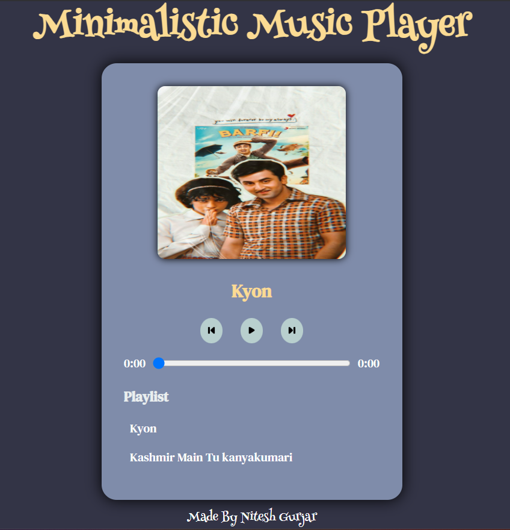

<p align="center">
  
</p>


A clean, responsive, and stylish music player built with **HTML**, **CSS**, and **JavaScript**. It supports audio playback, track switching, custom playlist UI, and interactive progress control – all in a minimal UI with a touch of elegance.

---

## 🚀 Features

- 🔊 Play/Pause music
- ⏮️ Previous/Next track navigation
- 📜 Custom playlist that updates dynamically
- 📈 Interactive progress bar with real-time time update
- 🖼️ Custom cover image per track
- 🧭 Responsive UI design with scrollbar-free scrolling

---

## 🖼️ Preview



---

## 🔗 Live Demo

👉 [Click here to try the music player](https://niteshgurjarr.github.io/music-player/)

---

## 🛠️ Tech Stack

- **HTML5** – structure
- **CSS3** – styling and layout (custom fonts, scrollbar hiding, hover effects)
- **JavaScript (Vanilla)** – interactivity, audio control, playlist generation

---

## 📂 Project Structure

```
music-player/
├── assets/
│   ├── back.png
│   ├── next.png
│   ├── pause.png
│   ├── preview.png
│   ├── play.png
│   ├── song1.mp3
│   ├── song1.jpg
│   ├── song2.mp3
│   ├── song2.jpg
│   ├── song3.mp3
│   ├── song3.jpg
│   ├── song4.mp3
│   ├── song4.jpg
│   ├── song5.mp3
│   └── song5.jpg
├── index.html
├── index.js
├── styles.css
└── README.md
```
## 👨‍💻 Author

***[Nitesh Gurjar](https://github.com/niteshgurjarr)***


